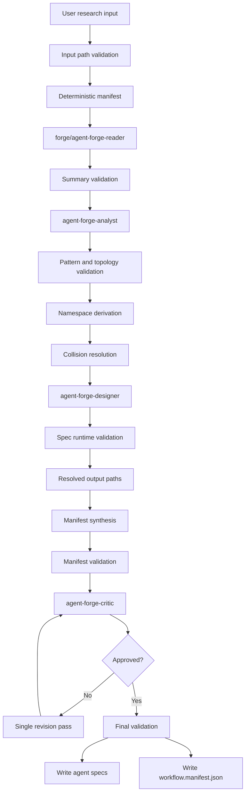
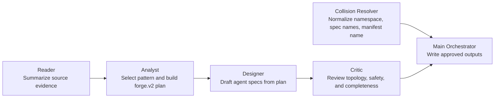
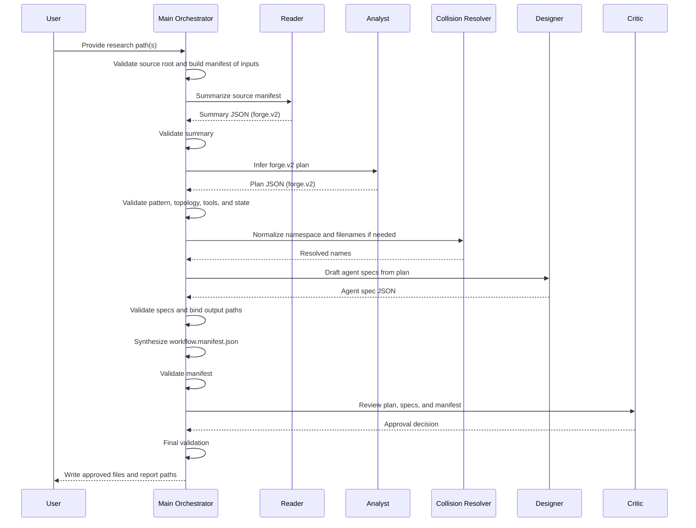

# Forge Pipeline

`forge` is a staged agent-generation pipeline that converts bounded research inputs into two outputs:

- OpenCode agent markdown specs
- a machine-readable orchestration manifest at `workflow.manifest.json`

The current design uses `forge.v2` contracts and treats Google Cloud's agentic workflow pattern guidance as the reference model for workflow selection.

## Purpose

- Read bounded research inputs from an approved source root.
- Convert those inputs into a structured summary that preserves lifecycle phases, artifacts, and approvals.
- Select the simplest viable Google-aligned workflow pattern.
- Infer a typed workflow plan with roles, artifacts, handoffs, state, and explicit review/checkpoint semantics.
- Draft agent specs from that plan.
- Synthesize a workflow orchestration manifest.
- Critique the full design before writing.
- Resolve namespace and filename collisions safely.

## Reference Model

`forge` uses the Google Cloud design-pattern guidance as a workflow taxonomy and selection rubric.

Supported top-level workflow types:

- `single-agent`
- `sequential`
- `parallel`
- `loop`
- `review-and-critique`
- `iterative-refinement`
- `coordinator`
- `hierarchical-task-decomposition`
- `swarm`
- `human-in-the-loop`
- `custom-logic`

Special rule:

- `ReAct` is modeled as a role behavior overlay, not as the only top-level workflow type.

## Pipeline Overview

The primary orchestrator lives in `forge/main.md` and delegates to these helpers:

- `forge/agent-forge-reader.md`
- `forge/agent-forge-analyst.md`
- `forge/agent-forge-designer.md`
- `forge/agent-forge-critic.md`
- `forge/agent-forge-collision-resolver.md`

## End-To-End Process

1. Validate user-supplied inputs against an approved source root.
2. Resolve a deterministic manifest of input files.
3. Summarize the manifest with `forge/agent-forge-reader`, preserving lifecycle phases, deliverables, and approval boundaries.
4. Validate summary schema, semantics, confidence, manifest equality, and source-traceable phase/checkpoint extraction.
5. Infer a `forge.v2` workflow plan with `forge/agent-forge-analyst`, preserving distinct stages when the source requires them.
6. Validate pattern choice, typed topology, artifacts, handoffs, state, review semantics, and least privilege.
7. Derive and normalize a namespace path.
8. Resolve namespace and agent filename collisions.
9. Draft agent specs with `forge/agent-forge-designer`.
10. Run deterministic validation on generated markdown, frontmatter, filenames, permissions, and tools.
11. Bind each generated agent to a canonical relative output path.
12. Synthesize fixed-name `workflow.manifest.json` from the validated plan and resolved paths.
13. Validate the orchestration manifest.
14. Review the complete design with `forge/agent-forge-critic`.
15. Rework once if needed, then validate again.
16. Perform a final validation pass.
17. Write approved files inside the agents directory only.

## Flow Diagram

## Helper Responsibilities

## Supported Pattern Semantics

### `single-agent`

- One agent owns the full task.
- No unnecessary multi-agent handoffs.
- Best for simpler workflows or strong single-role tool use.

### `sequential`

- Explicit ordered roles.
- Each non-final step produces artifacts for a later step.
- Best for fixed, linear pipelines.

### `parallel`

- Independent branches with explicit fan-out and fan-in.
- Requires a join role or merge contract.
- Best when work can happen concurrently.

### `loop`

- Repeated subflow with state and hard exit conditions.
- Requires explicit `max_iterations` or equivalent bound.

### `review-and-critique`

- Generator role plus critic role.
- Requires bounded revision budget and approval artifact.

### `iterative-refinement`

- A bounded refinement loop around a target artifact.
- Requires measurable or operationally checkable quality gates.
- Represented explicitly in `pattern.config.iterative_refinement`.

### `coordinator`

- Coordinator routes work to specialized workers.
- Requires task envelopes, routing policy, and escalation policy.

### `hierarchical-task-decomposition`

- Bounded delegation tree rooted at one planner or coordinator.
- Requires max depth and upward aggregation.

### `swarm`

- Bounded collaborative topology with peer-style participation.
- Requires shared-state rules, convergence rule, max rounds, and one final answer owner.

### `human-in-the-loop`

- Explicit approval or data-entry checkpoints.
- Requires resume path, timeout behavior, and approval artifact.

### `custom-logic`

- Explicit graph of nodes, edges, and conditions.
- Used only when simpler patterns cannot model the workflow safely.
- Requires explicit stop conditions and a bounded transition budget.

### `ReAct` Overlay

- Represented as `roles[].behavior.react`.
- Requires bounded iterations, observation policy, and completion rules.

## Validation Layers

- Input validation: source-root restrictions, traversal rejection, secret-file rejection.
- Summary validation: `forge.v2` schema, typed fields, citation/source consistency, phase/checkpoint extraction, content warnings, confidence handling, exact manifest equality.
- Plan validation: `forge.v2` plan schema, supported pattern selection, typed artifacts, typed handoffs, bounded state, least-privilege checks, pattern-specific invariants, and preservation of source-defined approvals and revision semantics.
- Spec validation: valid frontmatter, allowed frontmatter keys, unique `agent_id`, unique filenames, prompt completeness, concrete artifact/checkpoint ownership, and permission restrictions.
- Manifest validation: `forge.v2` manifest schema, topology correctness, exact role/path binding, bounded stopping rules, explicit final outputs, pattern-aligned checkpoint requirements, and explicit revision routing where required.
- Review validation: critic approval gate with blocking conditions.

## Retry And Repair Model

- Each helper gets at most 2 repair attempts.
- Malformed or semantically invalid helper output fails closed after the retry budget is exhausted.
- The critic gets at most 1 redesign loop before writes are blocked.
- The pipeline prefers a hard stop over partial output.

## Shared Contracts

### Summary Contract

- Version: `forge.v2`
- Produced by: `forge/agent-forge-reader`
- Consumed by: `agent-forge-analyst`
- Core fields:
  - `summary_version`
  - `approved_source_root`
  - `source_files`
  - `topics`
  - `key_points`
  - `phases`
  - `checkpoints`
  - `suggested_role_boundaries`
  - `non_merge_constraints`
  - `terminology`
  - `structure`
  - `citations`
  - `coverage_gaps`
  - `content_warnings`
  - `confidence`

### Plan Contract

- Version: `forge.v2`
- Produced by: `forge/agent-forge-analyst`
- Consumed by: `forge/agent-forge-designer`, `forge/agent-forge-critic`, primary orchestrator
- Core fields:
  - `plan_version`
  - `pattern`
  - `roles`
  - `artifacts`
  - `handoffs`
  - `state`
  - `rationale`
  - `risks`
  - `assumptions`
  - `confidence`

### Generated Agent Contract

- Produced by: `forge/agent-forge-designer`
- Consumed by: `forge/agent-forge-critic`, primary orchestrator
- Core fields:
  - `agent_id`
  - `filename`
  - `description`
  - `markdown`
  - `tools`

### Orchestration Manifest Contract

- Version: `forge.v2`
- Produced by: primary orchestrator
- Consumed by: `agent-forge-critic`, downstream runtime or reviewers
- Core fields:
  - `manifest_version`
  - `namespace_path`
  - `reference_patterns`
  - `pattern`
  - `entry_role`
  - `resolved_agents`
  - `artifacts`
  - `handoffs`
  - `state`
  - `human_checkpoints`
  - `topology`
  - `final_outputs`

## Manifest Model

The manifest is the runtime-facing representation of the workflow.

It should answer these questions deterministically:

- which pattern is in use?
- which role starts the workflow?
- which file implements each role?
- which artifacts are produced and consumed?
- which state is shared, private, or approval-bound?
- where are the human checkpoints?
- what are the stopping rules?
- who owns the final output?

The manifest filename is fixed as `workflow.manifest.json` inside the chosen namespace.

## Sequence Diagram

## Current Safety Posture

The pipeline is designed to be contract-driven and conservative:

- explicit helper allowlist in `forge/main.md`
- approved source root for reads
- deterministic manifests and output paths
- Google-aligned pattern selection
- typed artifacts, handoffs, and state
- least-privilege bias for generated tool grants
- review-before-write flow with critic approval
- orchestration manifest generation for advanced workflows

## Known Risks

These risks are still worth tracking:

1. Write-path hardening is not yet fully atomic.
   - The specs do not explicitly require last-moment `realpath` or symlink checks immediately before file creation.
   - Atomic create/write semantics are not described.

2. Runtime support for advanced patterns may lag behind the manifest model.
   - `forge` can describe `swarm`, `human-in-the-loop`, `hierarchical-task-decomposition`, and `custom-logic`, but an execution environment still needs to honor those semantics.

3. Frontmatter allowlisting is stronger but still policy-driven.
   - The pipeline now restricts expected metadata, but additional runtime enforcement may still be useful.

4. Injection handling is improved but not fully quarantined.
   - The pipeline treats source content as untrusted, but not every free-text field is guaranteed to be structurally sandboxed.

5. Absolute capability policy is still soft.
   - Least privilege is enforced by review and validation rules, but there is no completely separate hard deny-policy for all generated capabilities.

6. Filesystem edge cases remain.
   - Control characters, Unicode-confusable names, trailing spaces, and path length limits are not yet fully documented as blocked cases.

## Recommended Next Hardening Steps

- Add explicit atomic-write and pre-write symlink-check expectations.
- Add exact allowlists for frontmatter and permission metadata in runtime validation code, not only in documentation.
- Add a stricter deny-policy for high-risk generated permissions.
- Extend filename/path normalization rules for control chars, confusables, and path length limits.
- Add conformance fixtures for each supported workflow pattern.
- Add runtime simulation or dry-run validation for manifest execution semantics.

## Pattern Selection Heuristics

- Prefer `single-agent` when one role can safely own the work.
- Prefer `sequential` when the workflow has a known linear order.
- Prefer `parallel` when branches are independent and need a merge step.
- Prefer `review-and-critique` when a generated artifact must be validated before use.
- Prefer `coordinator` when routing among specialized workers is dynamic.
- Prefer `hierarchical-task-decomposition` when bounded delegation is required.
- Prefer `human-in-the-loop` for high-stakes approvals or subjective checkpoints.
- Use `custom-logic` only when simpler supported patterns cannot represent the workflow safely.
