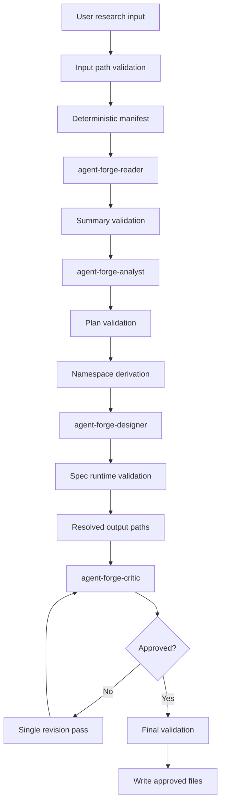
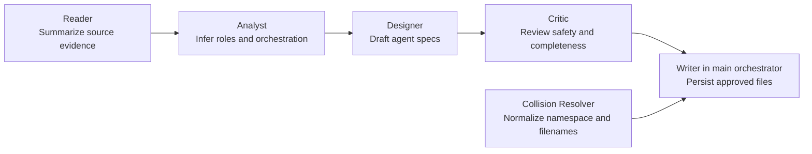
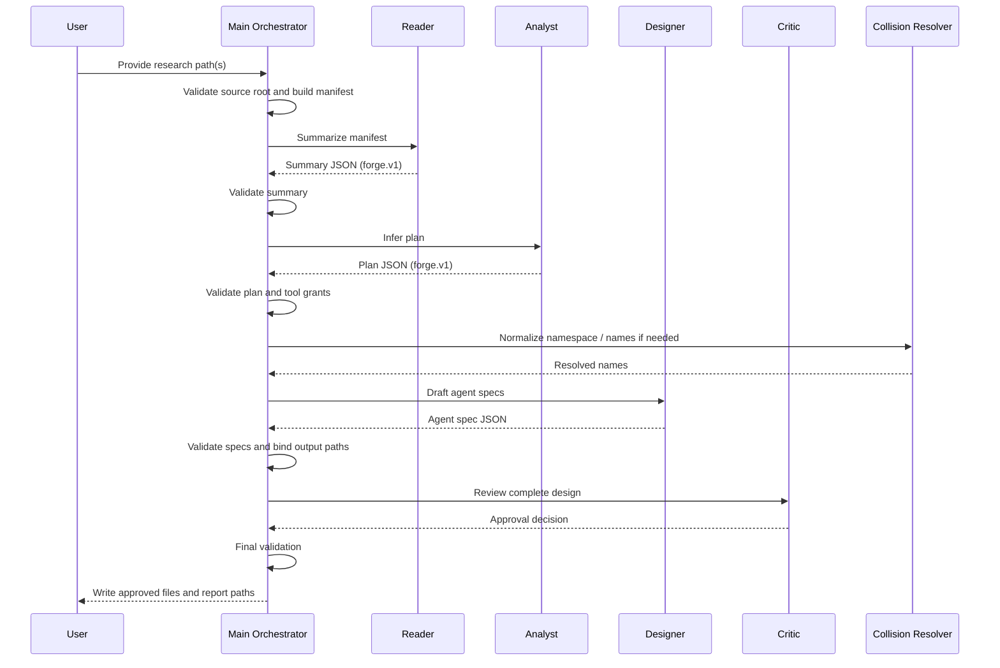

# Forge Pipeline

`forge` is a staged agent-generation pipeline that turns research inputs into OpenCode agent specs with explicit helper contracts, review gates, collision handling, and guarded writes.

## Purpose

- Read bounded research inputs from an approved source root.
- Convert those inputs into a structured summary.
- Infer a minimal agent plan and orchestration pattern.
- Draft agent specs.
- Critique the generated specs before writing.
- Resolve namespace and filename collisions safely.

## Pipeline Overview

The primary orchestrator lives in `forge/main.md` and delegates to these helpers:

- `forge/agent-forge-reader.md`
- `forge/agent-forge-analyst.md`
- `forge/agent-forge-designer.md`
- `forge/agent-forge-critic.md`
- `forge/agent-forge-collision-resolver.md`

## End-To-End Process

1. Validate user-supplied inputs against an approved source root.
2. Resolve a deterministic manifest of input files.
3. Summarize the manifest with `agent-forge-reader`.
4. Validate summary schema, semantics, and confidence.
5. Infer roles, tools, handoffs, and orchestration with `agent-forge-analyst`.
6. Validate the generated plan and least-privilege expectations.
7. Derive a normalized namespace path.
8. Draft agent specs with `agent-forge-designer`.
9. Run deterministic validation on generated markdown, frontmatter, filenames, and tools.
10. Bind each generated agent to a canonical relative output path.
11. Review the complete design with `agent-forge-critic`.
12. Rework once if needed, then validate again.
13. Perform a final validation pass.
14. Write approved files inside the agents directory only.

## Flow Diagram

## Helper Responsibilities

## Validation Layers

- Input validation: source-root restrictions, traversal rejection, secret-file rejection.
- Summary validation: `forge.v1` schema, typed fields, citation/source consistency, confidence handling.
- Plan validation: `forge.v1` plan schema, explicit handoffs, complete boolean tool maps, least-privilege checks.
- Spec validation: valid frontmatter, required keys, unique `agent_id`, unique filenames, prompt completeness.
- Path validation: normalized namespace path, canonical relative output path binding, collision resolution.
- Review validation: critic approval gate with blocking conditions.

## Retry And Repair Model

- Each helper gets at most 2 repair attempts.
- Malformed or semantically invalid helper output fails closed after the retry budget is exhausted.
- The critic gets at most 1 redesign loop before writes are blocked.
- The pipeline prefers a hard stop over partial output.

## Shared Contracts

### Summary Contract

- Version: `forge.v1`
- Produced by: `agent-forge-reader`
- Consumed by: `agent-forge-analyst`
- Core fields: `summary_version`, `source_files`, `topics`, `key_points`, `terminology`, `structure`, `citations`, `coverage_gaps`, `confidence`

### Plan Contract

- Version: `forge.v1`
- Produced by: `agent-forge-analyst`
- Consumed by: `agent-forge-designer`, `agent-forge-critic`
- Core fields: `plan_version`, `roles`, `pattern`, `handoffs`, `rationale`, `risks`, `assumptions`, `confidence`

### Generated Agent Contract

- Produced by: `agent-forge-designer`
- Consumed by: `agent-forge-critic`, primary orchestrator
- Core fields: `agent_id`, `filename`, `description`, `markdown`, `tools`

## Current Safety Posture

The pipeline is designed to be contract-driven and conservative:

- Explicit helper allowlist in `forge/main.md`
- Approved source root for reads
- Deterministic manifests and output paths
- Prompt and schema checks across stages
- Least-privilege bias for generated tool grants
- Review-before-write flow with critic approval

## Known Risks

These risks are still worth tracking:

1. Write-path hardening is not yet fully atomic.
   - The specs do not explicitly require last-moment `realpath` or symlink checks immediately before file creation.
   - Atomic create/write semantics are not described.

2. Frontmatter allowlisting is incomplete.
   - Validation requires expected keys, but the docs do not yet explicitly reject unknown metadata keys or dangerous permission overrides.

3. Manifest equality checking can be stricter.
   - The orchestrator resolves a deterministic manifest, but the documentation does not yet require exact manifest equality against returned `source_files` in membership and order.

4. Injection handling is improved but not fully quarantined.
   - The pipeline treats source content as untrusted, but not every free-text field is described as fully sanitized or structurally quarantined.

5. Absolute capability policy is still soft.
   - Least privilege is enforced by review and validation rules, but there is no separate absolute deny-policy for certain generated capabilities.

6. Path-binding validation can be stronger.
   - `agents`, `resolved_agents`, and `approved_paths` should be checked for exact one-to-one correspondence.

7. Filesystem edge cases remain.
   - Control characters, Unicode-confusable names, trailing spaces, and path length limits are not yet fully documented as blocked cases.

## Recommended Next Hardening Steps

- Add explicit frontmatter allowlisting and reject unknown top-level metadata keys.
- Require exact manifest equality between approved input manifest and returned `source_files`.
- Add exact one-to-one validation for `agent_id`, generated filename, resolved path, and approved path.
- Document atomic write expectations and pre-write symlink checks.
- Add a stricter deny-policy for high-risk generated permissions.
- Extend filename/path normalization rules for control chars, confusables, and path length limits.

## Sequence Diagram

